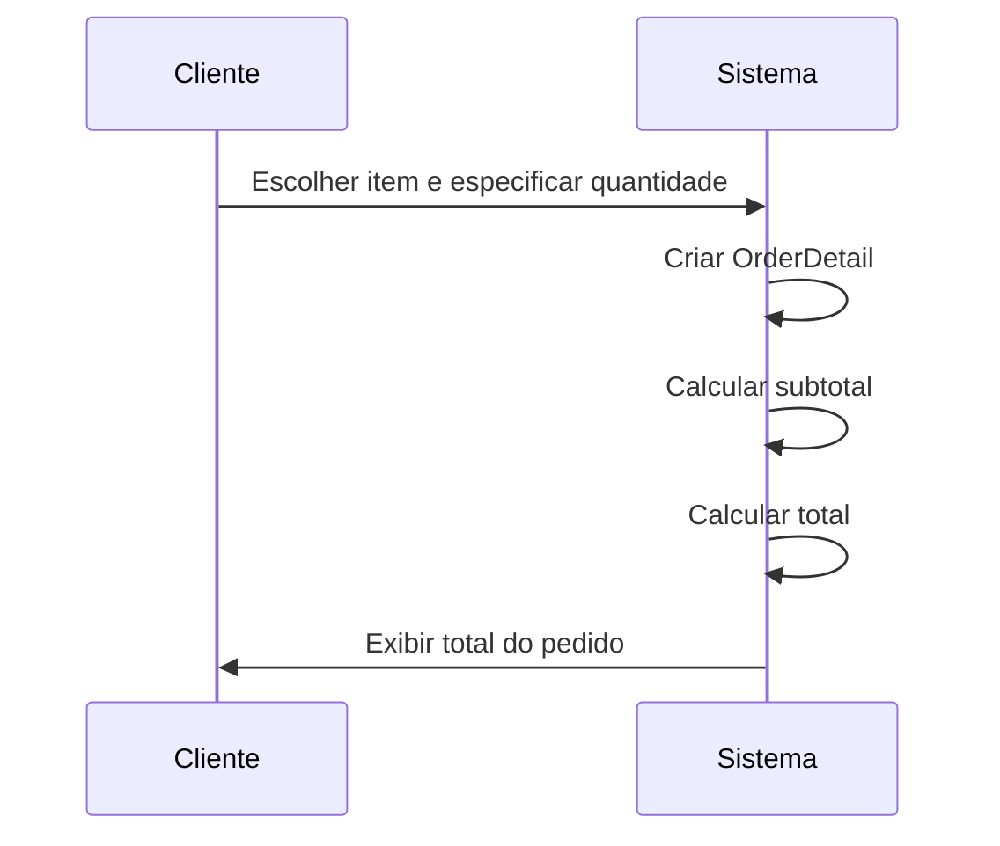
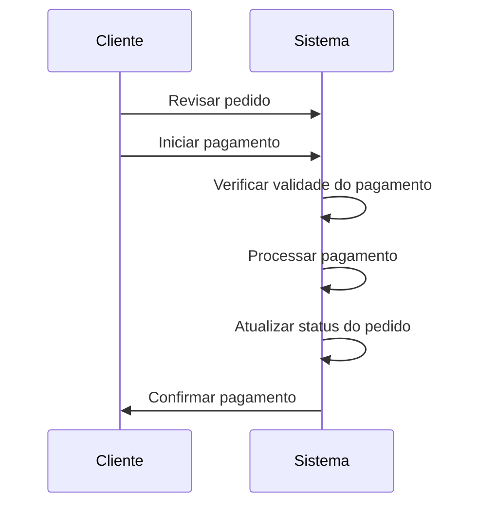

# Caso de Uso 1: Criar um Pedido
- Ator Principal: Cliente
- Ator Secundário: Sistema

## Etapas:

O cliente escolhe um item.
O cliente especifica a quantidade.
O cliente confirma a adição do item ao pedido.
O sistema calcula o subtotal e o total do pedido.
O sistema exibe o total para o cliente.
Condição de Conclusão Bem-Sucedida: O pedido é criado com sucesso e o total é exibido ao cliente.

## Fluxo Principal:

Cliente solicita adicionar item.
Sistema cria um OrderDetail.
Sistema calcula subtotal.
Sistema calcula total.
Sistema exibe total.
Fluxo Alternativo:

Se o item não estiver disponível, o sistema exibe uma mensagem de erro.

---

# Caso de Uso 2: Processar Pagamento
Ator Principal: Cliente
Ator Secundário: Sistema

## Etapas:

O cliente revisa o pedido.
O cliente decide efetuar o pagamento.
O sistema verifica a validade do pagamento.
O sistema processa a transação.
O sistema atualiza o status do pedido.
Condição de Conclusão Bem-Sucedida: O pagamento é processado e o status do pedido é atualizado.

## Fluxo Principal:

Cliente revisa pedido.
Cliente inicia pagamento.
Sistema processa pagamento.
Sistema atualiza status do pedido.
Sistema confirma pagamento.

## Fluxo Alternativo:

Se o pagamento falhar, o sistema exibe uma mensagem de erro.

